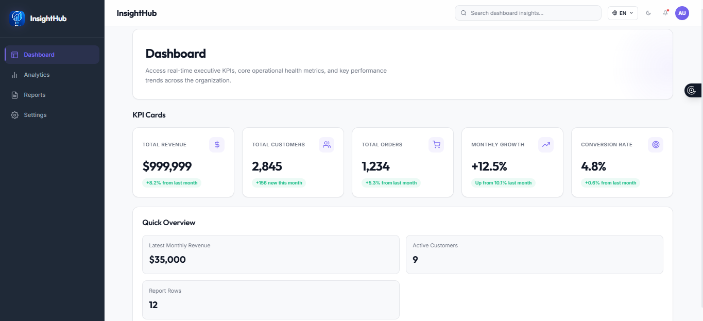
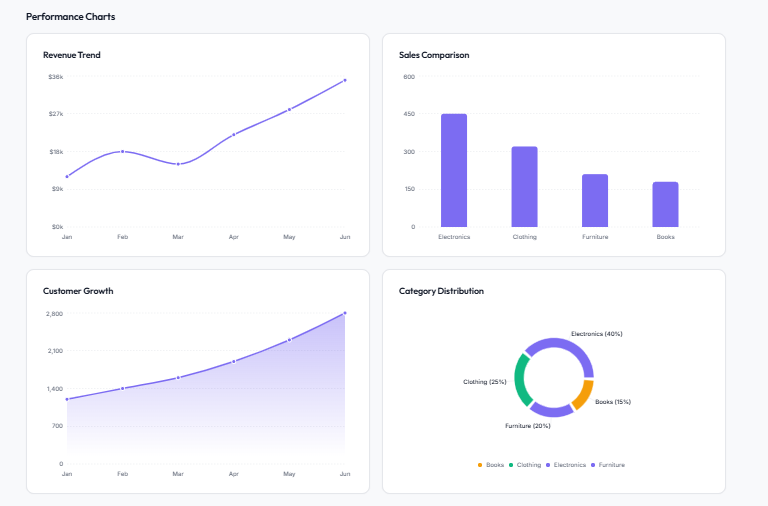
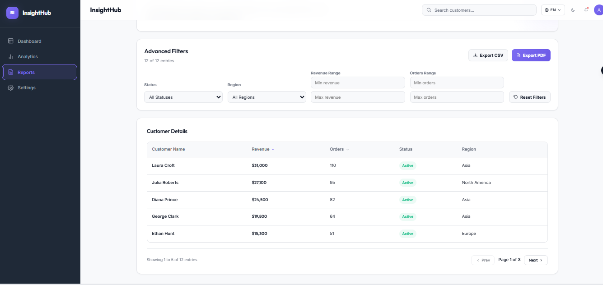
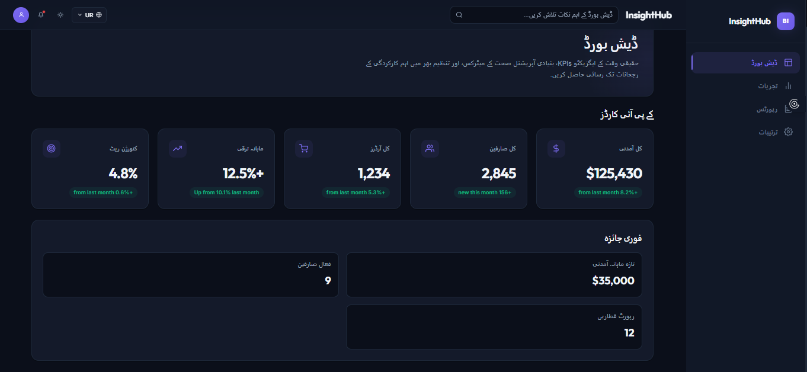

# 📊 Business Intelligence Analytics Dashboard

## Overview

The **Business Intelligence Analytics Dashboard** is a modern and responsive web application developed as part of the **TEYZIX CORE Frontend Web Development Internship (June Batch)**.

It enables organizations to monitor business performance through interactive dashboards, KPI tracking, customer reporting, analytics, and data visualization, helping management make informed business decisions.

---

# ✨ Features at a Glance

* 📊 Executive Dashboard
* 📈 Interactive Analytics Charts
* 💳 KPI Overview Cards
* 👥 Customer Reports
* 🔍 Search, Sorting & Filtering
* 📄 PDF Export
* 📁 CSV Export
* 🌙 Light / Dark Mode
* 🌐 Multi-language Support
* 📱 Fully Responsive Design
* ⚙️ Redux Toolkit State Management
* 🔗 API Integration using Axios

---

# 📸 Screenshots

## Dashboard



---

## Analytics



---

## Reports



---

## Dark Mode



---

# 🚀 Features

## Dashboard

* Executive Overview
* Responsive Sidebar Navigation
* Professional Header
* KPI Cards
* Business Metrics Overview

## Analytics

* Revenue Trend Chart
* Sales Comparison Chart
* Customer Growth Chart
* Category Distribution Chart

## Reports

* Customer Performance Table
* Search Functionality
* Revenue & Orders Sorting
* Status Filtering
* Advanced Filters
* Pagination
* CSV Export
* PDF Export

## Settings

* Light & Dark Theme
* Theme Persistence
* Language Selection
* Dashboard Preferences

---

# 🛠 Technologies Used

* React.js
* JavaScript (ES6)
* CSS3
* Redux Toolkit
* Axios
* React Router
* Recharts
* React Icons
* Vite

---

# 📱 Responsive Design

Optimized for:

* 💻 Desktop
* 📱 Tablet
* 📲 Mobile Devices

---

# 📂 Project Structure

```text
src/
│
├── components/
├── pages/
├── redux/
├── services/
├── data/
│
├── App.jsx
└── main.jsx
```

---

# ⚙️ Run Instructions

1. Open the project folder.
2. Run:
   npm install
3. Run:
   npm run dev

---

# 🌐 Live Demo

Coming Soon (Will be updated after deployment)

---

# 📂 Repository

https://github.com/iqraamin054-code/business-intelligence-dashboard

---

# 👩‍💻 Author

**Iqra Amin**

Developed for the **TEYZIX CORE Frontend Web Development Internship (June Batch)**.
